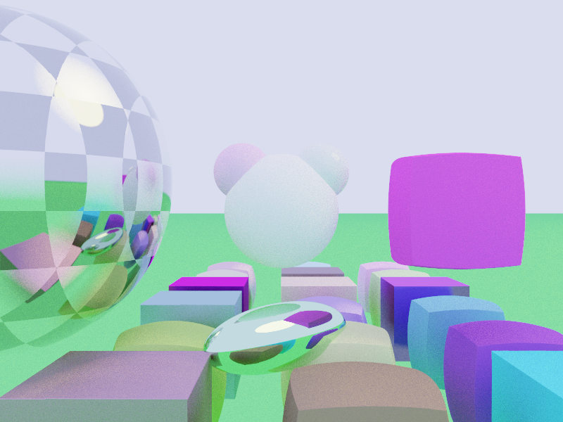

## Raytracing render for signed distance field functions

My goal was to write simple code, so it's performance is bad (several minutes for picture 800*600 and 128 samples for pixel)

I use ray marching. Each model described as signed distance function (including sphere, ellipsis, plane, quad and combinations of them)

**Features:**

* reflections 
* refractions
* antialiasing
* depth of focus 
* multi-threading

 
## How to run

This is a normal sbt project, you can compile code with `sbt compile` and run it
with `sbt run`, `sbt console` will start a Dotty REPL.
